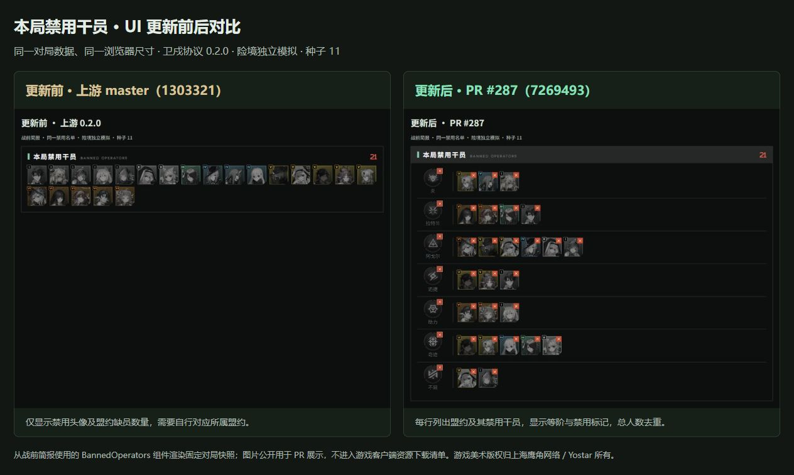
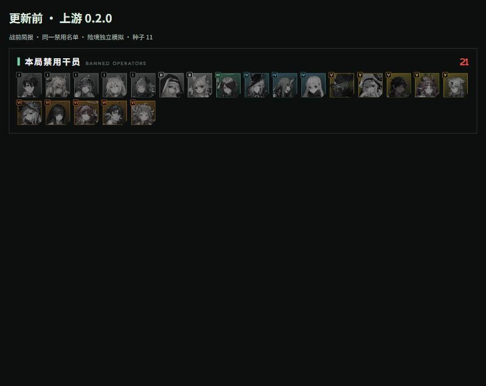
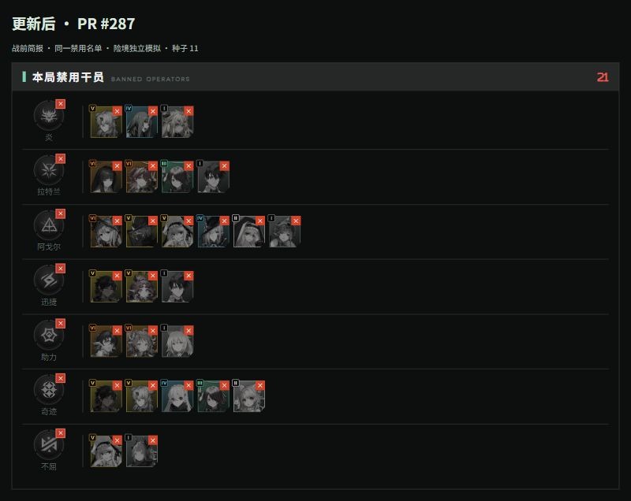

# PR #287：禁用干员 UI 前后对比

公开用于 [sganggs/Stronghold-Protocol PR #287](https://github.com/sganggs/Stronghold-Protocol/pull/287) 的界面展示。

| 更新前：上游 0.2.0 | 更新后：PR #287 |
| --- | --- |
|  |  |

## 截图依据

- 更新前代码：`1303321407f9a9b80c68e0a4d47b40871a5d06c3`。
- 更新后代码：`7269493f9c285573434ad063f2b12f89c3a5f905`。
- 使用原项目 `Match` 引擎生成同一份固定对局快照：独立模拟、险境（`NORMAL`）、随机种子 `11`，共 21 名禁用干员。
- 由两个版本实际使用的 `BannedOperators` 组件与原版 CSS 渲染，复用相同数据和本地素材。浏览器尺寸均为 1280×720；原始区域截图均为 800×636，包含来源标签。对比总图是将两张原始截图并排展示后的浏览器截图。
- 更新后共有 7 个盟约分组；多盟约干员按各归属行展示，标题仍按 21 名独立干员计数。图中多盟约重复展示属于 PR 已标注的 `[ASSUMED]` 显示约定。
- 这些图片仅保存在 fork 的独立展示分支 `docs/pr-287-ui-comparison`，不属于功能分支，也不进入游戏打包或客户端下载清单。

这是实际代码渲染的界面截图，不是 AI 绘制的界面示意图。未下载新的游戏素材。

游戏美术素材版权归上海鹰角网络 / Yostar 所有。本仓库图片用于非官方同人项目的功能说明与审阅。
